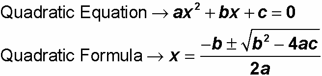

# Chapter 2 Labs

Based in part on lab exercises from https://github.com/orhs-apcs/chapter-2

## Getting Started

See instructions [here](https://github.com/nuhs-apcs/chapter-1#getting-started).

## Labs

1. Student Grades
2. Circle
3. Painting a Room
4. Quadratic Formula
5. Rolling Dice

## Student Grades

Write a program called `StudentGrades.java` that prints a table with a list of at least 5 students together with their grades (lab points, bonus points, and the total) in the format below:

```
///////////////////\\\\\\\\\\\\\\\\\\\
==          Student Points          ==
\\\\\\\\\\\\\\\\\\\///////////////////
Name			Lab 	Bonus 	Total
---- 			--- 	----- 	-----
Joe				43 		7 		50
William 		50 		8 		58
Mary Sue		39 		10 		49
```

The requirements for the output are as follows:

1. Print the header on the top as illustrated
2. Use the _tab character_ to align the columns of the table
3. Make up your own student names and points

## Circle

Write a program called `CircleTest.java` that prompts the user to input the radius of a circle and uses that information to print out the circle's circumference and area. A sample output of the program is shown below (floating points truncated):

````
Enter the radius of a circle in inches: 5
The circle's circumference is 31.41... inches
The circle's area is 78.53... square inches
````

Make sure to include the proper units in the output. Also, the constant `Math.PI` is an accurate approximation of pi.

## Painting a Room

Write a program `Paint.java` that calculates the amount of paint needed to paint the walls of a rectangular room. Here is a general outline for the program:

1. Create a scanner
2. Use it to prompt for and read in the dimensions of the room (length, width, height). The prompt should include a message to the user with units (e.g. `Enter the length of the room in feet:  ` )
3. Calculate the area that needs to be painted
4. Compute the amount of paint needed
5. Print the gallons of paint needed (e.g. `24 gallons of paint are needed`)

When you've finished and your program compiles, test it with 12 feet as the length, 16 feet as the width, and 10  feet as the height. (The output should be 1.6 gallons; make sure you are checked off before moving on to the next part) 

Now, suppose the room has doors and windows that don't need to be painted. Ask the user to enter the number of doors and the number of windows in the room and adjust your calculations appropriately. Assume that each door is 20 square feet and each window is 15 square feet. Test your program with the dimensions above plus 2 windows and 1 door. (The output should be 1.457 gallons)

## Quadratic Formula

Write a program `QuadraticFormula.java` that calculates the real roots of a quadratic equation using the quadratic formula. The general form of the equation and the formula are shown below:



The program should prompt the user to enter `double` values for each coefficient (a, b, and c) and print out the two roots. Don't worry about the cases where the discriminant is negative. Here's a sample output of the program:

````
Enter a:  2
Enter b:  7
Enter c:  1
Root 1 is -0.14921894064178787
Root 2 is -3.350781059358212
````

## Rolling Dice

Write a program `DiceTest.java` that simulates rolling a pair of dice. Print out the values of each die as well as their sum. Here's a sample output of the program:

````
Die 1 is a 3
Die 2 is a 1
Their total is 4

````

